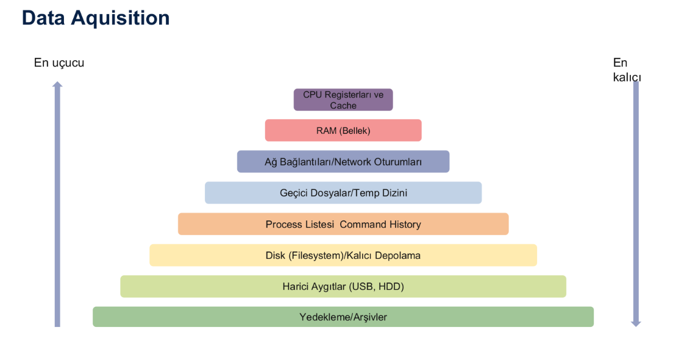

# 🐧 Linux Canlı Sistem Analizi

> Uçucu veriler, sistem kapatıldığında (örneğin elektrik kesintisi ya da bilgisayarın yeniden başlatılması durumunda) kaybolan verilerdir.  
> Bu nedenle **sistem çalışırken** toplanmaları gerekir.

---

## 📊 Uçuculuk Sırasına Göre Veriler

Aşağıdaki görselde, en uçucudan en az uçucuya doğru veri türleri sıralanmıştır:



---

## 🔍 1. Çalışan İşlemler

- Çalışan işlemler genellikle **ilk bakılan** yerlerdendir.
- **`ps` komutu** bu işler için kullanılır.

**Kullanım:**

```bash
ps aux
```

- Bu komut ile tüm işlemleri (arka plandakiler dahil) görebiliriz.
- Daha gelişmiş izleme için: `htop` gibi 3. parti araçlar da kullanılabilir.

---

## ⏰ 2. Sistem Zamanı

- Zaman çizelgesi oluşturulurken ve log'larla karşılaştırma yapılırken **sistem saati** önemlidir.

**Komutlar:**

```bash
date
timedatectl
```

---

## 👤 3. Oturum Açmış Kullanıcılar

- Sistemde kimlerin aktif olduğunu görmek için:

```bash
who
w
last
```

- `who` → Oturum açmış kullanıcıları, terminal adlarını ve saatleri gösterir.

---

## 📂 4. Açık Dosyalar ve Bağlantılar

- **Açık dosya**: Şu anda sistemde erişilen dosyalar (kullanıcı ya da process bazlı).
- **Ağ bağlantıları** da aynı şekilde canlı olarak analiz edilebilir.

### 🔧 `lsof` Komutu

```bash
lsof /path/file_or_directory
lsof -p <PID>
lsof -u <username>
```

#### 🔎 PID Öğrenmek için:

```bash
ps aux | grep mssql
```

> Bu komut MSSQL ile ilgili satırları getirir. Buradan PID alınarak `lsof -p <PID>` komutuyla detaylara bakılabilir.

---

## 🌐 5. Ağ Bağlantıları

### 📡 `netstat` Komutu

- Aktif bağlantılar, portlar, protokoller ve ilişkili işlemler hakkında detay verir.

**Bazı parametreler:**

| Parametre | Açıklama |
|-----------|----------|
| `-a`      | Dinleyen ve dinlemeyen tüm soketleri göster |
| `-l`      | Sadece dinleyen soketleri göster |
| `-t`      | TCP bağlantılarını göster |
| `-u`      | UDP bağlantılarını göster |
| `-4`      | IPv4 bağlantılarını göster |
| `-6`      | IPv6 bağlantılarını göster |
| `-n`      | Host ve port adlarını çözümlemeden sayısal olarak göster |
| `-p`      | Hangi programa ait olduğunu göster – root izni gerekebilir |

**Örnek:**

```bash
netstat -at
```

---

## 🌐 6. Ağ Konfigürasyonu

```bash
ifconfig
ip addr
```

> Burada DNS tünellemesi gibi ağ manipülasyonlarına dair izler bulunabilir.

---

## 🧠 7. Komut Geçmişi

```bash
history
```

> Bu sadece **sistem açıkken yazılmış komutları** kaydeder.

---
