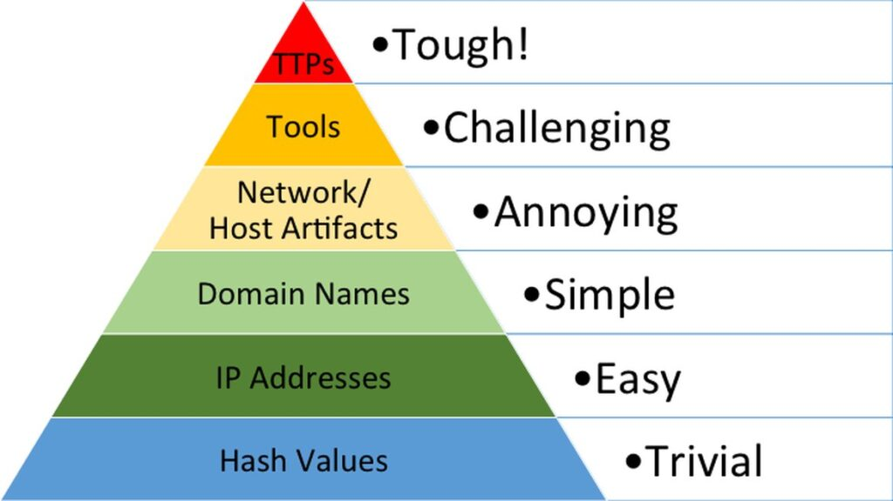

# Pain Piramidi Nedir?

**Pain Piramidi**, siber güvenlikte **IoC'leri (Indicators of Compromise - Uzlaşma Göstergeleri)** altı farklı seviyede sınıflandıran kavramsal bir modeldir. Bu model, siber tehditleri anlamak ve önceliklendirmek için kullanılır. Seviyeler, bir saldırıya uğrayan tarafın (organizasyon) bu IoC'leri keşfedip harekete geçmesi durumunda **saldırgan için ne kadar "acı verici"** olacağına göre düzenlenir. Piramidin **tepesi**, saldırgan için en zor ve maliyetli (en acı verici) seviyeyi temsil eder.

 ## *IoC Nedir?*

***IoC (Indicator of Compromise - Uzlaşma Göstergesi)**, bir siber saldırının veya güvenlik ihlalinin varlığını işaret eden verilerdir. Bu göstergeler, bir sistemin tehlikeye atıldığını tespit etmek ve tehdidi analiz etmek için kullanılır. SOC ekipleri, IoC'leri izleyerek tehditleri hızlıca fark eder ve müdahale eder.* 

## Pain Piramidi'nin Mantığı

Pain Piramidi, IoC'lerin tespit edilmesi ve engellenmesinin saldırgan üzerindeki etkisini değerlendirir. Alt seviyelerde IoC'ler kolayca değiştirilebilir veya gizlenebilirken, üst seviyelere doğru IoC'ler saldırganın stratejisini kökten değiştirmesini gerektirir, bu da onlara daha fazla "acı" (maliyet, zaman, çaba) verir.

## Pain Piramidi Seviyeleri ve Açıklamaları

Aşağıda, Pain Piramidi'nin altı seviyesi ve her birinin neden farklı "acı" değerlerine sahip olduğu açıklanmıştır:

### 1) Hash Değerleri

**Hash değeri**, bir dosyayı benzersiz bir şekilde tanımlayan sayısal bir değerdir. Bu değer, bir **hash algoritması** sonucunda ortaya çıkar. En yaygın hash algoritmaları arasında **MD5**, **SHA-1** ve **SHA-2** (özellikle **SHA-256** en yaygını) bulunur. Günümüzde **SHA-2**, güvenli bir algoritma olarak kabul edilir.

- **SHA-256**: 64 basamaklı onaltılık bir sayı üretir ve 256 bitlik bir hash değeri döndürür.
    
- **Özellik**: Bir dosyada en ufak bir bit bile değişse, hash değeri tamamen değişir. Bu nedenle, her dosyanın hash değeri benzersiz olmalıdır. Eğer bir algoritma bunu sağlayamazsa, güvenli sayılmaz.
    

**Güvenlik uzmanları**, hash değerlerini zararlı yazılımlarla ilgili bilgi edinmek için kullanır. **VirusTotal** ve **MetaDefender Cloud** gibi platformlar, zararlı yazılımların hash değerlerini tutar ve detaylı analiz sunar. Bu sitelerde:

- Bir dosyanın kaç farklı kaynaktan zararlı olarak işaretlendiğini görebilirsiniz.
    
- Analiz sonuçlarına erişebilirsiniz.
    

#### Hash Değerleri Pain Piramidi'nde Neden En Alt Seviyede?

Bir zararlı yazılımın hash değerini değiştirmek, saldırgan için oldukça kolaydır. En ufak bir değişiklik (örneğin, dosyanın bir bitini değiştirmek) yeni bir hash değeri oluşturur. Bu yeni değer, güvenlik sistemlerinde kayıtlı olmayabilir. Bu nedenle, hash değerleri **Pain Piramidi'nin en alt seviyesinde** yer alır, çünkü saldırgan için atlatması en kolay adımdır.

### 2) IP Adresleri

**IP adresi**, bir ağa bağlı cihazı tanımlamak için kullanılan bir kimliktir. İnternete bağlanan her cihazın bir IP adresi olması gerekir; bu adres, cihazı tanımlar.

**Savunma açısından**, bir saldırganın kullandığı IP adresi değerli bir bilgidir. Eğer bu IP adresi zararlıysa, **güvenlik duvarı (firewall)** üzerinden engellenebilir.

#### IP Adresleri Pain Piramidi'nde Neden Aşağı Seviyede?

Saldırganlar, kullandığı IP adresini çok kolay bir şekilde değiştirebilir. Örneğin, yeni bir proxy, VPN veya sunucu kullanarak farklı bir IP ile saldırıya devam edebilir. Bu nedenle, IP adresleri **Pain Piramidi'nde düşük bir seviyede** yer alır.

Ayrıca, saldırganlar IP adreslerinin engellenmesini zorlaştırmak için **Fast Flux** adlı bir yöntem kullanabilir:

- **Fast Flux**: Bir alan adını sürekli değişen birden fazla IP adresiyle ilişkilendirir. Bu, güvenlik uzmanlarının IP adresini tespit etmesini ve engellemesini zorlaştırır.

## 3) Alan Adları (Domain Names)

**Alan adı**, bir IP adresini metinsel bir isme eşler. **Pain Piramidi**'nde saldırganlar için **orta seviye** bir IoC'dir, çünkü:

- Yeni alan adı almak ve DNS kayıtlarını güncellemek zahmetlidir.
    
- Ancak, bazı alan adı sağlayıcılarının gevşek kuralları ve API'leri bu süreci kolaylaştırır.
    

### Saldırganların Kullanımı

Saldırganlar, sahte siteler oluşturmak için alan adlarını kullanır. Örneğin:

- **Sahte**: adıdas.de (Punycode saldırısı).
    
- **Gerçek**: adidas.de.
    

**Punycode saldırısı**, ASCII olmayan karakterleri Unicode'dan ASCII'ye dönüştürerek sahte siteler oluşturur.  
Saldırganlar, kötü amaçlı alan adlarını gizlemek için **URL kısaltıcı** servisler kullanabilir.

- **İpucu**: Kısaltılmış URL'nin sonuna + ekleyerek gerçek URL görülebilir.
    

### Tespit

Kötü amaçlı alan adları, **proxy** veya **web sunucusu kayıtları** ile tespit edilebilir.  
**Chrome**, **Edge**, **Safari** gibi tarayıcılar, Punycode alan adlarını iyi çevirir.

### Pain Piramidi'nde Yeri

Alan adları, hash değerleri ve IP adreslerinden daha zahmetli olduğu için **orta seviye**dedir, ancak kolay değiştirilebilirlikleri tepe seviyeden uzaktır

## 4) Ağ Yapıtları (Network Artifacts)

**Ağ yapıtları**, **Pain Piramidi**'nde **sarı bölge** (orta-yüksek seviye) IoC'lerdir. Ağ saldırılarını tespit etmek, saldırganın **taktik veya araç değiştirmesini** gerektirir ve bu, zaman alır. Bu durum, savunma tarafına **tehditleri tespit etme ve yanıt verme** için zaman kazandırır.

### Tespit Yöntemleri

Ağ yapıtları, şu yollarla tespit edilebilir:

- **Tshark** gibi ağ analiz araçları.
    
- **Snort** gibi IDS (Intrusion Detection System) kayıtları.
    
- **PCAP dosyaları** analizi.
    

Örnek Tshark komutu:

```bash
tshark -Y http.request -T fields -e http.host -e http.user_agent -r analysis_file.pcap
```

Bu komut, **User-Agent** (internete bağlanan yazılımın kimliği) bilgisini filtreler.

Saldırganın kullandığı özel **User-Agent** dizilerini tespit ederseniz, bunları **engelleyebilirsiniz**.

## 5) Araçlar (Tools)

**Araçlar**, **Pain Piramidi**'nde yüksek seviye bir IoC'dir. Eğer saldırganın araçlarını engellemeyi başarırsanız, pes edebilir  çünkü **yeni araç geliştirmek zahmetli ve maliyetlidir**.

### Saldırganların Kullandığı Araçlar

Saldırganlar, **komuta-kontrol (C2)** için arka kapılar veya özel **kötü amaçlı .exe dosyaları** kullanabilir.

### Tespit Yöntemleri

- **Antivirüs programları**: Tespit kuralları ve **YARA kuralları** ile kötü amaçlı yazılımları yakalar.
    
- **MalwareBazaar** ve **MalShare**: Kötü amaçlı yazılım örneklerine erişim sağlar.
    
- **SOC Prime Threat Detection Marketplace**: Çeşitli tehdit türlerine karşı tespit kurallarının paylaşıldığı bir platformdur.
    

### Fuzzy Hashing

**Fuzzy hashing**, benzer dosyaları tespit etmek için güçlü bir yöntemdir. Küçük değişiklikleri olan iki dosyayı benzerlik analizine göre eşleştirir.

- Örnek: **SSDeep**, fuzzy hashing için kullanılan bir araçtır.

## 6) TTP'ler (Tactics, Techniques, and Procedures)

**TTP'ler**, taktik, teknik ve prosedürlerin kısaltmasıdır. Saldırganın hedefine ulaşmak için attığı **tüm adımları** ifade eder ve **MITRE ATT&CK** matrisini içerir.

Eğer TTP'leri hızlıca **yakalayıp engellerseniz**, saldırganın motivasyonunu kırarsınız. Örneğin:

- **Windows Event Log** izleyerek **Pass-the-Hash** saldırısını tespit ederseniz:
    
    - Tehlikeye giren bilgisayarı bulup düzeltebilirsiniz.
        
    - Ağ içindeki **yanal hareketi** durdurabilirsiniz.
        

### Saldırgana Kalan Seçenekler

Bu noktada saldırganın iki seçeneği kalır:

1. Geri dönüp **yeni bir strateji** oluşturmak.
    
2. **Tamamen pes etmek**. (İkinci seçenek daha olası! 😊)